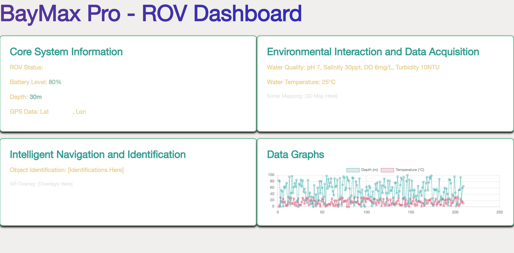

# 🌊 BayMax Pro - ROV Dashboard 🌊

## 🌐 Overview 🌐

**BayMax Pro** is a sophisticated dashboard designed for **Remotely Operated Vehicles (ROVs)** traversing underwater. It serves as a comprehensive tool to visualize real-time sensor data, control thrusters, and monitor environmental parameters, enabling seamless interaction with the ROV.

 <!-- Replace with the actual path to your screenshot -->

## ⚙️ Features ⚙️

- 🖥️ **Core System Information** 🖥️
  - **Displays** the ROV's operational status, battery level, depth, and GPS data.
  - **Offers real-time updates** on key parameters to monitor the ROV's health and position.
  
- 🌿 **Environmental Interaction and Data Acquisition** 🌿
  - **Presents real-time data** on water quality, including pH, salinity, dissolved oxygen levels, and turbidity.
  - **Provides water temperature readings** and 3D sonar mapping visualizations.
  
- 🧠 **Intelligent Navigation and Identification** 🧠
  - **Facilitates object identification** and Augmented Reality (AR) overlays for enhanced navigation.
  - **Employs advanced algorithms** to identify underwater objects and display pertinent information.
  
- 📊 **Data Graphs** 📊
  - **Visualizes sensor data** through real-time graphs.
  - **Allows users to observe** trends and anomalies in the data instantly.
